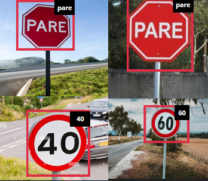

  <h1>traffic-sign-detector</h1>
  
  
A machine learning project to detect traffic signs using tensorflow, Nvidia TAO Toolkit and DeepStream.

  

The developers of the project:

<a href="https://github.com/AntonioFuziy">Antonio Fuziy</a>

<a href="https://github.com/Edortizneto">Edgard Ortiz Neto</a>

<a href="https://github.com/roguetaver">André Tavernaro</a>

**The main documentation for this project is located on the link below:**

[Notebook](detector/transfer_learning.ipynb)

The result of the project is a traffic sign detector that runs in real-time on the webcam as it is shown os the GIFs below.

    
    
    

